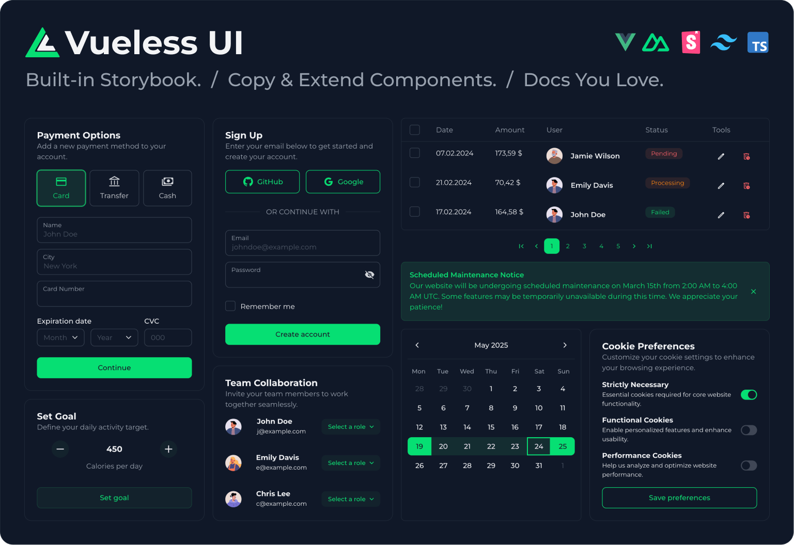
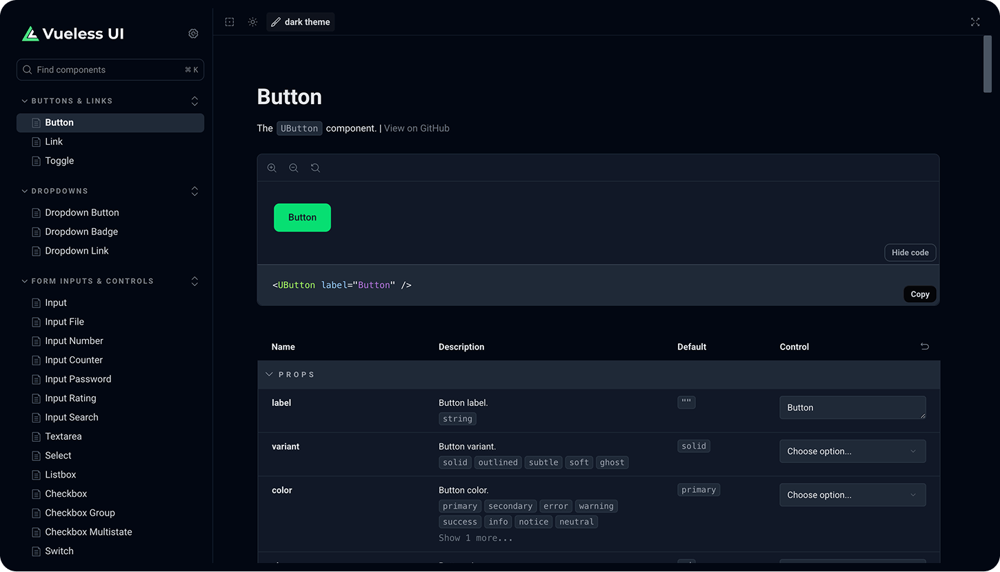
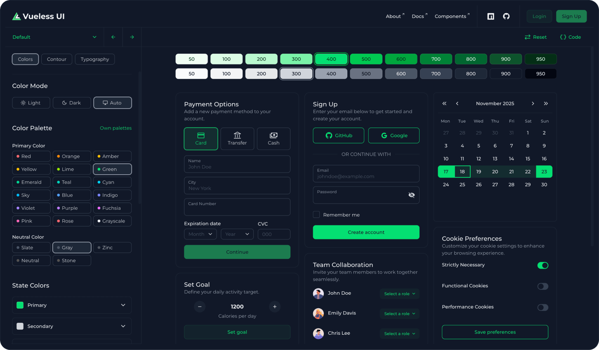

# Vueless UI

A UI library with Open Architecture for Vue.js 3 and Nuxt.js 3 / 4, powered by [Storybook v10](https://storybook.js.org) and [Tailwind CSS v4](https://tailwindcss.com).

**With Vueless UI, you’re free to:**
- 🪄️ Customize any component
- 📋 Copy and extend existing ones
- 🧱 Build your own from scratch
- 📕 Document it all seamlessly in Storybook

[Documentation](https://docs.vueless.com/) | [UI Components](https://ui.vueless.com/) | [Theme Builder](https://my.vueless.com/theme) | [About](http://vueless.com/)

### Key features

- 🧩 65+ crafted UI components (including range date picker, multi-select, and nested table)
- ✨ Open Architecture lets you customize, copy, extend, and create your own components
- 📕 Built-in Storybook support
- 🪩 Theme Builder for runtime theme customization
- 🌈 Beautiful default UI theme
- 🌀 Unstyled mode
- 🌗 Light and dark mode
- 🧬 Design tokens powered by CSS variables
- ⚙️ Server-side rendering (SSR)
- 🌍 Internationalization (i18n)
- ♿️ Accessibility (a11y)
- 🖼️ Inline SVG icons
- 🪄 Auto component imports (as you use them)
- 🧿 Uncompiled source in npm for better DX
- 🧪️ 1400+ unit tests ensuring consistent logic
- 🛡️ Full TypeScript support with type safety

## Built-In Storybook

No setup, no hacks — just a fully functional Storybook preset ready to test your Vueless UI design system out of the box.

[Demo](https://ui.vueless.com) | [Package](https://www.npmjs.com/package/@vueless/storybook) | [Docs](https://docs.vueless.com/installation/storybook)



## Theme Builder

Customize colors, rounding, and typography at runtime, generate full palettes, and export a ready-to-use theme to your project.

[Try Vueless UI Theme Builder](https://my.vueless.com/theme) 🚀



## Quick Start (Vue)

### New project

To get started with Vueless UI, simply paste the following code into your terminal:

```bash
npm create vueless@latest
```

This command guides you through a few setup options, then generates a new scaffolded Vue + Vueless UI project with the complete application structure.

---

### Existing project

1. Install `vueless` UI library packages.

```bash
npm install vueless
npx vueless init
```

2. In the file where you create the Vue application, add the following code:
```javascript
import { createApp } from 'vue';
import { createVueless } from "vueless";
import App from './App.vue';

const vueless = createVueless();

createApp(App).use(vueless).mount('#app');
```

3. Import Tailwind CSS and Vueless at the top of the main CSS file.

```scss
@import "tailwindcss";
@import "vueless";
```

4. Add Vite plugins.

```javascript
import { Vueless, TailwindCSS, UnpluginComponents } from "vueless/plugin-vite";

export default defineConfig({
  plugins: [
    ...
    Vueless(),
    TailwindCSS(),
    UnpluginComponents(),
  ],
  ...
})
```

## Quick Start (Nuxt)

1. Install Vueless Nuxt module.

```bash
npm install @vueless/nuxt
npx vueless init
```


2. Register `@vueless/nuxt` into the Nuxt config modules section.
```javascript
export default defineNuxtConfig({
  modules: [
    '@vueless/nuxt'
  ],
  ...
})
```

3. Import Tailwind CSS and Vueless at the top of the main CSS file.

```scss
@import "tailwindcss";
@import "vueless";
```

## Ecosystem

* [@vueless/storybook](https://github.com/vuelessjs/vueless-storybook) - Storybook preset for Vueless UI component library [(docs)](https://docs.vueless.com/installation/storybook).
* [@vueless/nuxt](https://github.com/vuelessjs/vueless-module-nuxt) - Vueless UI module for Nuxt.js [(docs)](https://docs.vueless.com/installation/nuxt).
* [create-vueless](https://github.com/vuelessjs/vueless-create) - CLI tool to quickly start a Vueless UI project from a template [(docs)](https://docs.vueless.com/installation/vue).
  * [vueless-quickstart](https://github.com/vuelessjs/vueless-quickstart) - Vue + Vueless UI + JavaScript project template.
  * [vueless-quickstart-ts](https://github.com/vuelessjs/vueless-quickstart-ts) - Vue + Vueless UI + TypeScript project template.

## Contributing

* We encourage you to contribute to Vueless! Please check out the
[contributing to Vueless](CONTRIBUTING.md) for guidelines.
* Trying to report a possible security vulnerability in Vueless? Please
check out our [security policy](SECURITY.md) for guidelines.
* Everyone interacting in Vueless and its sub-projects' codebases, issue trackers, chats, and mailing lists is expected to follow our [code of conduct](CODE_OF_CONDUCT.md) rules.

## License

Vueless is released under the [MIT License](https://opensource.org/licenses/MIT).

---
From Ukrainians to a Peaceful World 🇺🇦


