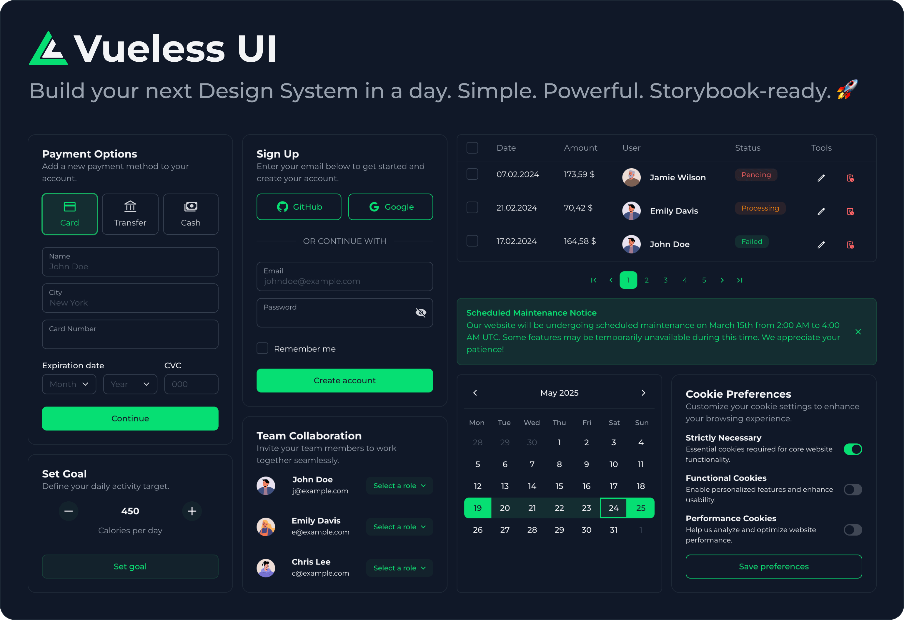

# Vueless UI

Vueless is an open-source UI library and design system framework for Vue.js 3 and Nuxt.js 3, built on top of Tailwind CSS v4.

It’s completely styleless, allowing you to extend or override default styles without modifying the components themselves — only your custom styles are included in the final build.

Vueless is simple enough for everyday use and powerful enough for advanced scenarios, making it ideal for quickly building beautiful UIs in minutes or developing a fully customized corporate UI library that strictly follows your design guidelines.

[Documentation](https://docs.vueless.com/) | [UI Components](https://ui.vueless.com/) | [Website](http://vueless.com/)

## Key features

- 65+ UI components (including range date picker, multi-selects, and nested table)
- Built-in Storybook support
- Beautiful, modern default UI theme
- Light and dark mode support
- Unstyled mode
- Flexible color palettes
- Runtime theme and color switching
- Design tokens powered by CSS variables
- Powerful yet simple styling customization system
- Internationalization (i18n)
- Accessibility (a11y)
- Server-side rendering (SSR) friendly
- 1000+ built-in SVG icons
- Full TypeScript support with type safety

## Advance features

- Copy and extend existing components
- Create your own components
- Define default values for props
- Add or hide props to components
- NPM package includes full source code (no TypeScript transpilation)


## Quick Start (Vue)

1. Install `vueless` UI library packages.

```bash
npm install vueless
npx vueless init
```

2. In the file where you create the Vue application, add the following code:
```javascript
import { createApp } from 'vue';
import { createVueless } from "vueless";
import App from './App.vue';

const vueless = createVueless();

createApp(App).use(vueless).mount('#app');
```

3. Import Tailwind CSS and Vueless at the top of the main CSS file.

```scss
@import "tailwindcss";
@import "vueless";
```

4. Add Vite plugins.

```javascript
import { Vueless, UnpluginComponents } from "vueless/plugin-vite";

export default defineConfig({
  plugins: [
    ...
    Vueless(),
    UnpluginComponents(),
  ],
  ...
})
```

## Quick Start (Nuxt)

1. Install Vueless Nuxt module.

```bash
npm install @vueless/nuxt
npx vueless init
```


2. Register `@vueless/nuxt` into the Nuxt config modules section.
```javascript
export default defineNuxtConfig({
  modules: [
    '@vueless/nuxt'
  ],
  ...
})
```

3. Import Tailwind CSS and Vueless at the top of the main CSS file.

```scss
@import "tailwindcss";
@import "vueless";
```

## Contributing

* We encourage you to contribute to Vueless! Please check out the
[contributing to Vueless](CONTRIBUTING.md) for guidelines.
* Trying to report a possible security vulnerability in Vueless? Please
check out our [security policy](SECURITY.md) for guidelines.
* Everyone interacting in Vueless and its sub-projects' codebases, issue trackers, chats, and mailing lists is expected to follow our [code of conduct](CODE_OF_CONDUCT.md) rules.

## License

Vueless is released under the [MIT License](https://opensource.org/licenses/MIT).


