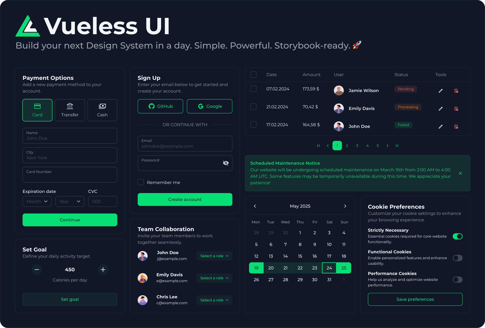

# Getting Started

<figure><figcaption></figcaption></figure>

Vueless is an open-source UI library and design system framework for Vue.js 3 and Nuxt.js 3, built on top of Tailwind CSS v4.

It’s completely styleless, allowing you to extend or override default styles without modifying the components themselves — only your custom styles are included in the final build.

Vueless is simple enough for everyday use and powerful enough for advanced scenarios, making it ideal for quickly building beautiful UIs in minutes or developing a fully customized corporate UI library that strictly follows your design guidelines.

### **Key features:**

* 🧩 65+ UI components (including range date picker, multi-selects, and nested table)
* 📘 Built-in Storybook support
* 🌈 Beautiful, modern default UI theme
* 🌗 Light and dark mode support
* 🌀 Unstyled mode
* 🎨️ Flexible color palettes
* 🎛️ Runtime theme and color switching
* 🧬 Design tokens powered by CSS variables
* ✨ Powerful yet simple styling customization system
* 🌍 Internationalization (i18n)
* ♿️ Accessibility (a11y)
* ⚙️ Server-side rendering (SSR) friendly
* 🖼️ 1000+ built-in SVG icons
* 🛡️ Full TypeScript support with type safety

### **Advance features:**

* 🧰 Copy and extend existing components
* 🧱 Create your own components
* 🔧️ Define default values for props
* 🔩️ Add or hide props to components
* 🧿 `npm` package ships full source without TypeScript transpilation for better DX

