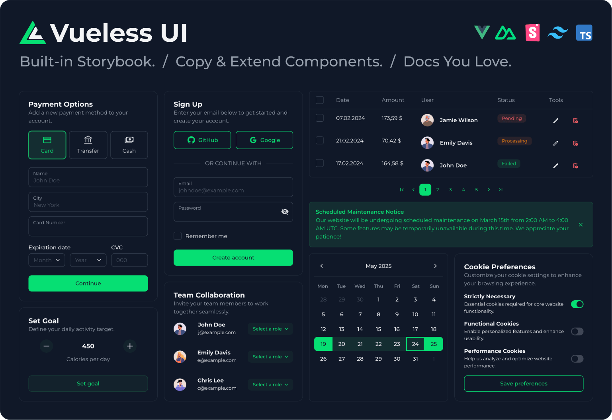

# Getting Started

<figure><figcaption></figcaption></figure>

Vueless UI – a UI library with Open Architecture for Vue.js 3 and Nuxt.js 3 / 4, powered by [Storybook v10](https://storybook.js.org/) and [Tailwind CSS v4](https://tailwindcss.com/).

**With Vueless UI, you’re free to:**

* 🪄️ Customize any component
* 📋 Copy and extend existing ones
* 🧱 Build your own from scratch
* 📕 Document it all seamlessly in Storybook

### **Key features**

* 🧩 74 crafted UI components (including range date picker, multi-select, and nested table)
* ✨ Open Architecture lets you customize, copy, extend, and create your own components
* 📕 Built-in Storybook support ([docs](installation/storybook.md))
* 🪩 Theme Builder for runtime theme customization ([open](https://my.vueless.com/))
* 🌈 Beautiful default UI theme
* 🌀 Unstyled mode
* 🌗 Light and dark mode
* 🧬 Design tokens powered by CSS variables
* ⚙️ Server-side rendering (SSR)
* 🌍 Internationalization (i18n)
* ♿️ Accessibility (a11y)
* 🖼️ Inline SVG icons
* 🪄 Auto component imports (as you use them)
* 🧿 Uncompiled source in npm for better DX
* 🧪️ 1600+ unit tests ensuring consistent logic
* 🛡️ Full TypeScript support with type safety
