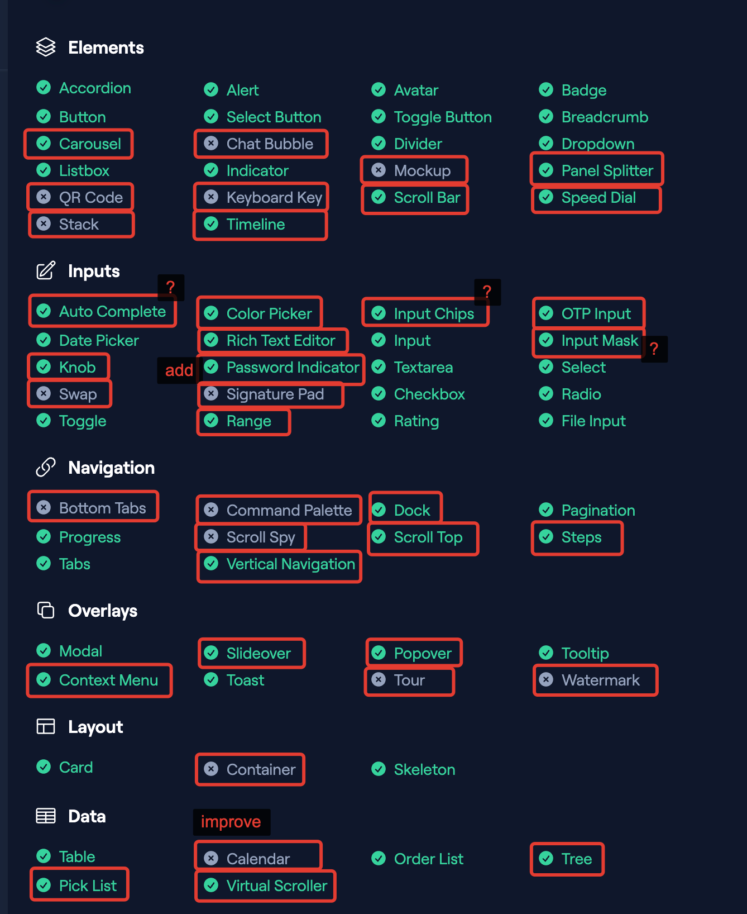

# General

Vueless gathers all component settings in one place — a plain JavaScript object. This includes styles, default prop values, i18n, and more.


You can find component default settings in the “Default Config” section at the end of each component docs page in the [Vueless UI documentation](https://ui.vueless.com/).


The default Vueless component configs can be customized globally under the `component` key in the`vueless.config.{js,ts}`.

## Usage

Here is an example of customizing the `USelect` component. In this example, we partially redefine some styles (Tailwind CSS classes), internationalization values, and default props.


```js
export default {
  component: {
    USelect: {
      wrapper: "border-brand-400 w-64",
      selectedLabel: "text-lg font-bold px-4",
      i18n: {
        clear: "Remove",
        addMore: "Add item",
      },
      defaults: {
        size: "lg",
        clearable: false,
        dropdownIcon: "arrow_down",
      },
    }
  }
};
```


## Inspecting config keys

To enhance the developer experience, the component name and config key are displayed in the browser console (dev environment only) under the attributes `vl-component` and `vl-key.`

<figure><figcaption></figcaption></figure>

For components with nested components, two additional attributes, `vl-child-component` and `vl-child-key`, indicate the nested component and its corresponding config key.&#x20;

<figure><figcaption></figcaption></figure>

Learn more how to [style nested components](nested-components-styling.md).
